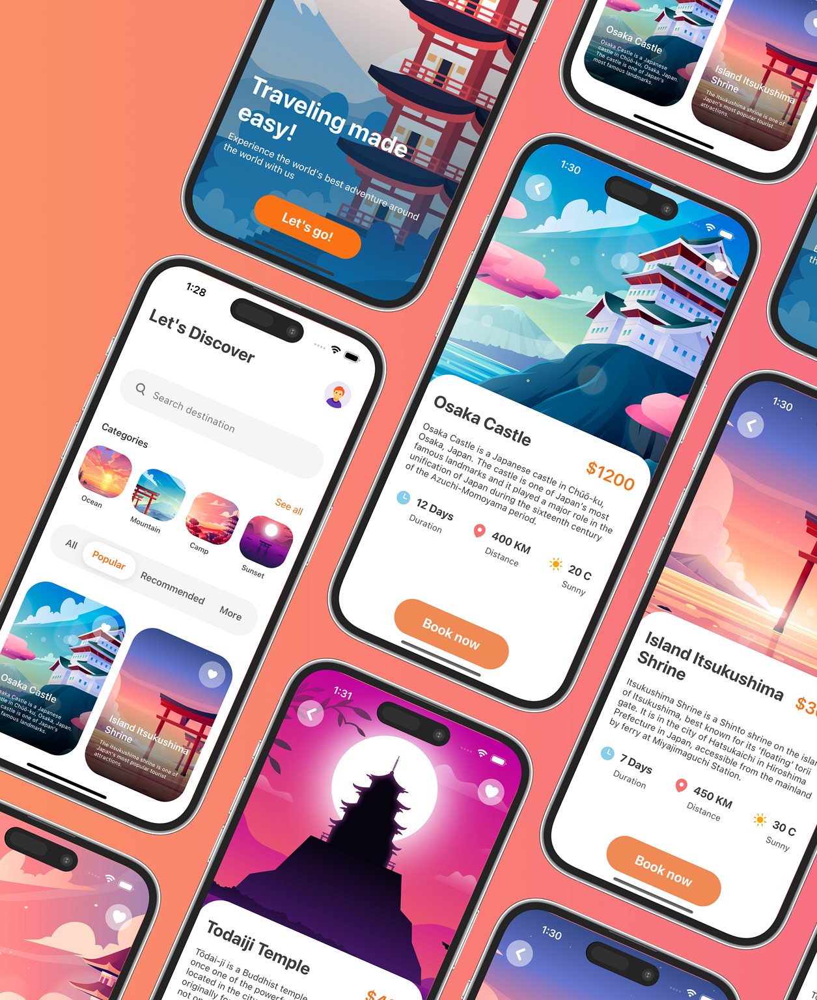

## Travel-App-React-Native


  
### 📘 Installation
Clone the repo to your directory and install the packages through npm using:
```
npm install
```

### 🔬 Run
Run the project with Metro Bundler
```
npx expo start
```


### 👇 Follow me;
- https://github.com/emmanuelishola123
- https://twitter.com/Engr__SoluTion
- https://www.linkedin.com/in/emmanuelishola1/
- https://www.instagram.com/emmanuel__ishola/
